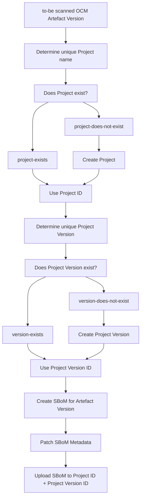

# ADR 002: Retain BlackDuck assessments across Artefact Versions

| Status   | Proposed                  |
|----------|---------------------------|
| Date     | 2026-04-29                |
| Deciders | Philipp Heil, Jonas Brand |

## Context and Problem Statement

BlackDuck (BD) follows a concept of project groups, where each project group contains projects.
One project can have multiple project versions.
Assessments and overwrites are shared across project versions, but not across projects or project groups.

The current ODG implementation maps each OCM artefact version to a dedicated BD project, with just one dummy project version.
This, however, leads to a situation where BD internal assessments and overwrites are not considered across versions of an OCM artefact.

To address this, the OCM-to-BD mapping needs to be changed so that each OCM artefact is mapped to one BD project, and each OCM artefact version is mapped to one BD project version.

## Decision Drivers

* **Consistency within BlackDuck**: BD assessments and overwrites need to be re-used across versions of the same OCM artefact.
* **OCM Mapping**: An end-user must be able to clearly map one OCM artefact version to one BD project version.

## Considered Options

1. **Modify BDIO File** - Adjust BDIO file to gain full control over BD project and version parameters.
2. **Manually create Project and Version** - Instead of re-using the BDIO approach, create BD projects and versions manually and upload contents to the desired location.
3. **Use SBoM Upload** - Instead of modifying the proprietary BDIO file format, use open-source-backed SBoM standards for content uploads, where SBoM metadata can be used to control BD project version behaviour.
4. **Synchronise Assessments externally** - Export all assessments made on BD project version level, and correlate them to the OCM artefact (versionless). Reapply, whenever a new OCM artefact version is scanned in BD (independently of the used BD project version structure)

## Pros and Cons of the Options

### Option 1: Modify BDIO File

Pros:

* Minimally invasive, as BDIO is already used as BD content source

Cons:

* Unknown side effects, as we do not know what other assumptions BD takes based on BDIO file
* Proprietary file format; there is no public standard that describes the semantics of the BDIO file
* Tighter coupling with BD tooling; the SBoM scanner underlying the ODG BD extension would not be easily replaceable

### Option 2: Manually create Project and Version

Pros:

* Full control over BD project and version behaviour

Cons:

* SBoM upload cannot be used to populate BD project versions; an alternative would be required (e.g. detect.sh CLI)

### Option 3: Use SBoM Upload

Pros:

* Full control over BD project and version behaviour
* Open-source standard with publicly documented file format semantics

Cons:

* Requires manual tinkering with SBoM metadata
* Unknown side effects in case BD makes assumptions on SBoM metadata content

### Option 4: Synchronise Assessments externally

Pros:

* Decoupled from BD tooling

Cons:

* Inconsistencies due to timing; There is no hook when an assesment was performed in BD
* Expensive implementation as the external system would need to be able to express all assessment options available in BD
* Potential collision with ODG rescoring and overwrite concepts

## Decision Outcome

Chosen option 3 **"Use SBoM Upload"**, because running the `detect.sh` CLI would introduce additional complexity around providing a stable environment with the necessary build tools.
Therefore, it comes down to influencing project and version parameters during SBoM upload, as BDIO upload is effectively
just an opinionated SBoM upload.

In both cases, SBoM metadata must be modified. Choosing the option where the file format is well-documented and backed by an open-source standard is the preferred approach.

## More Information

### High-level Architecture

### Contract

**Mappings**:

| Property | Values |
| -------- | ------ |
| BlackDuck Project Name | `Component Name`, `Artefact Name`, `Artefact Type`, `ODG Unique ID` (see below), (optional: `Artefact Extra ID`) |
| BlackDuck Project Version | `Component Version`, `Artefact Version` |
| ODG Unique ID | `Component Name`, `Artefact Name`, `Artefact Type`, (optional: `Artefact Extra ID`) |

**Hint**:
While from a pure OCM perspective the Artefact Extra ID appears to be mandatory, there are known cases where version information is redundantly included in the Artefact Extra ID.
To address these cases, the Artefact Extra ID must either be optional, or operators must have control over which fields are considered.

## Discovery and Distribution

This will be implemented as a modification of the existing BD ODG extension. The BDIO part will be replaced with SBoM generation based on open-source tools (Syft + potential re-use of the SBoM ODG extension). SBoM metadata will be patched in place. The upload mechanism will be changed to use proper BD APIs for arbitrary SBoM upload.

Additionally, the logic of creating BD Projects and Project Versions (as described above) will also be part of this extension modification.

## Conclusion

This decision will fulfill the goal of reusing BD's built-in assessment mechanism across versions of the same artefact by properly leveraging the Project Version concept.
Additionally, the extension will remove the implicit dependency on BDBA and instead rely on open-source SBoM tooling.

From a **configuration perspective**, this is a **non-breaking** change. Operators may need to configure the handling of the aforementioned OCM Artefact Extra ID scenario.

From a **BlackDuck perspective** this is a **breaking change**.
Users will have to adjust to the new Project Version structure.
