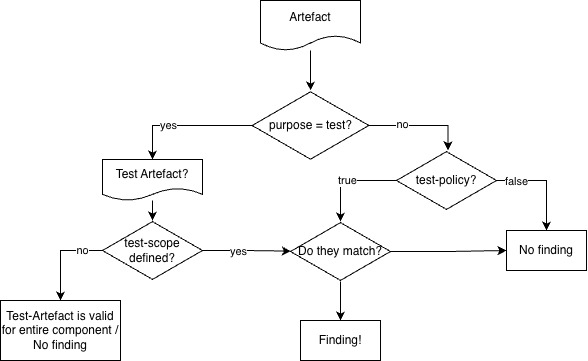

Evidence Checker Extension
==========================

Purpose
-------

Tests are a crucial part of software development, making sure the software's functionality stays intact despite the introduction of new features and enhancements. To prove the software's stability it is therefore often required to document and store test results of unit tests.

Therefore, the aim of the evidence checker extension is to create a finding for an artefact/resource in case no test evidences from unit tests have been found for this artefact.

Labels used for the extension
-----------------------------

The extension uses three labels in your component descriptor as described below.

1. Purpose Label
~~~~~~~~~~~~~~~~

The purpose label defines the purpose of the artefact respectively what the artefact is used for. The value of the purpose label could be such as 'lint', 'sast' or 'test'. E.g., if the value is 'test' we know that this artefact is in fact a test evidence.

.. code-block:: yaml

    - name: gardener.cloud/purposes
      signing: false
      value:
        - test

2. Test Policy Label
~~~~~~~~~~~~~~~~~~~~

The test policy label defines whether an artefact requires unit tests - and therefore test evidences - or not. E.g., a helmchart does not require unit tests, while an OCI-image would require unit tests.

.. code-block:: yaml

   - name: gardener.cloud/test-policy
     value: false / true

3. Test Scope Label
~~~~~~~~~~~~~~~~~~~

The test scope label is set in the component descriptor of a test artefact (aka an artefact whose purpose label has the value 'test) and it defines for which other artefacts it represents the test evidence.

If you do not specify any value in this label it is automatically assumed that the test artefact is valid for all artefacts within a component.

.. code-block:: yaml

    - name: gardener.cloud/test-scope
              value:
                - artefact-1
                - artefact-2

Functionality
-------------

1. The extension scans each artefact of a component and first validates whether the currently scanned artefact is a test evidence itself or not. This is achieved with the use of the gardener.cloud/purposes label. An artefact is considered a test evidence provided the label's value is 'test'.

2. Provided the gardener.cloud/purposes label's has NOT been given the value 'test' the extension further checks, whether the artefact requires a test or not. This is achieved with the gardener.cloud/test-policy label which is either 'true' or 'false.

3. In case an artefact has been identified as a test artefact (as described in step 1) the extension further checks, for which artefacts within the component the test-evidence is valid for. This can be defined with the help of the gardener.cloud/test-scope label.

4. In case one of the artefacts identified in step 2 is not covered by the test artefacts(aka evidences) a finding will be created and test-evidences will have to be provided retrospectively.

