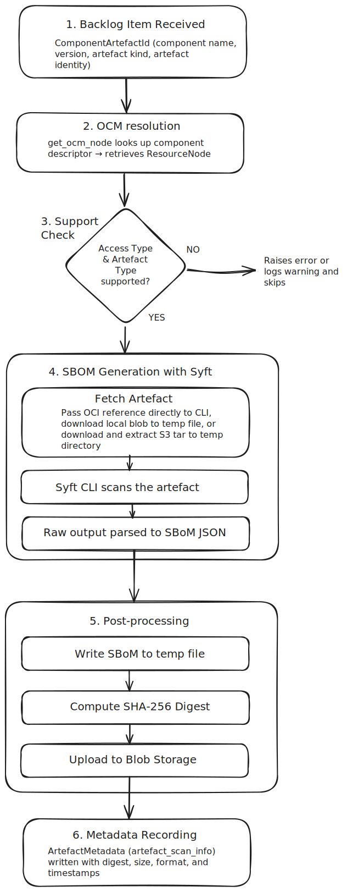

================
SBOM-Generator
================

The SBOM-Generator extension generates Software Bill of Materials (SBoM)
documents for the OCM resources of your components. It uses
`Syft <https://github.com/anchore/syft>`_ to scan artefacts directly,
and stores the generated SBoMs in the ODG blob storage. SBoMs can
be downloaded from the ODG Dashboard or via API.

How-to Guides
=============

Users
-----

How do I download SBoM documents for my product or its sub-components?
^^^^^^^^^^^^^^^^^^^^^^^^^^^^^^^^^^^^^^^^^^^^^^^^^^^^^^^^^^^^^^^^^^^^^^^

1. Add your product to the ODG Dashboard.

2. Open your product page.

3. To download the SBoM for your **product**, click the ``DOWNLOAD SBOM`` button.

   .. image:: ../res/download-sbom-button.svg
      :alt: Download SBOM button

   This opens the SBoM popover, where all sub-components are grouped into two
   sections: **Ready** and **Not ready**.

   .. image:: ../res/download-sbom-popover.svg
      :alt: Download SBOM Popover

   The popover also shows the configured output format, and displays the access
   type and artefact type for each sub-component.

   .. hint::
      The popover updates in real time. No manual refresh is needed.

4. To download the SBoM for a specific **sub-component**, open the sub-component
   first, then click the ``DOWNLOAD SBOM`` button.

How can I manually trigger SBoM generation for a component?
^^^^^^^^^^^^^^^^^^^^^^^^^^^^^^^^^^^^^^^^^^^^^^^^^^^^^^^^^^^^
Open the ``DOWNLOAD SBOM`` popover for your component. Any sub-components whose
SBoM has not been generated yet appear in the **Not ready** section. When there
are pending sub-components, a ``Trigger SBOM generation`` button is shown.
Clicking it schedules SBoM generation for all of them immediately. The popover
updates in real time, and completed SBoMs move from **Not ready** to **Ready**
as they finish.

Operators
---------

How do I diagnose a failed SBoM generation?
^^^^^^^^^^^^^^^^^^^^^^^^^^^^^^^^^^^^^^^^^^^^

Open the **SBOM-Generator** section in the ODG Dashboard sidebar. The logs show
the status of each run, including errors, warnings, and timestamps, making it
straightforward to identify and diagnose issues.

Reference
=========

Configuration
-------------

The extension is configured under the ``sbom_generator`` key.

.. code-block:: yaml

   sbom_generator:
     enabled: True
     delivery_service_url: http://delivery-service:5000
     output_format: cyclonedx       # or 'spdx'
     interval: 86400                # re-scan every 24 hours
     mappings:
       - prefix: ''                 # matches all components
         aws_secret_name: ~         # AWS secret name (required for S3 artefacts)

**Top-level options**

.. list-table::
   :widths: 25 15 15 45
   :header-rows: 1

   * - Option
     - Type
     - Default
     - Description
   * - ``enabled``
     - bool
     - ``true``
     - Enable or disable the extension.
   * - ``delivery_service_url``
     - string
     - —
     - URL of the delivery service instance.
   * - ``output_format``
     - string
     - ``cyclonedx``
     - Output format: ``cyclonedx`` or ``spdx``.
   * - ``interval``
     - int (seconds)
     - ``86400``
     - Maximum time before an artefact is re-scanned.
   * - ``mappings``
     - list
     - ``[]``
     - Per-prefix component mappings. See mapping fields below.

**Mapping fields** (each entry in ``mappings``)

.. list-table::
   :widths: 25 15 15 45
   :header-rows: 1

   * - Option
     - Type
     - Required
     - Description
   * - ``prefix``
     - string
     - yes
     - Component name prefix. Use ``''`` to match all components.
   * - ``aws_secret_name``
     - string
     - no
     - Name of the AWS secret used to access S3 artefacts. Required when multiple AWS secrets are configured.

How it works
============

When a component is picked up for scanning, the SBOM-Generator resolves its
component descriptor from the configured OCM repositories, retrieves each
``Resource``, and scans it using the Syft CLI binary via subprocess.
For ``ociRegistry`` resources, the image reference is passed directly to the
CLI. For ``localBlob/v1``, the blob is downloaded to a temporary file first.
For ``s3``, the tar archive is downloaded and extracted to a temporary directory
before scanning.

Once the SBoM is produced, it is serialised to JSON, hashed (SHA-256), and
uploaded to the delivery-service blob storage. The digest, file size, and
output format are recorded as ``ArtefactMetadata`` of type
``artefact_scan_info`` for that resource, which is what the dashboard queries
to determine whether an SBoM is ready for download.

The diagram below shows the end-to-end generation flow:

